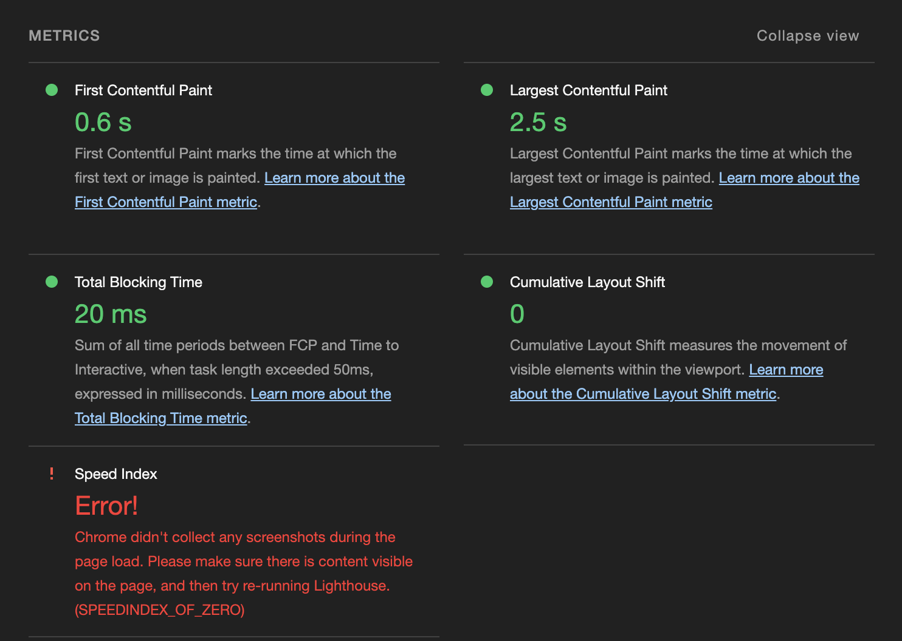

# First run Lighthouse CI

## Results in github action

Checking assertions against 1 URL(s), 3 total run(s)

5 result(s) for http://localhost:38367/index.html :

    ✘  color-contrast failure for minScore assertion
        Background and foreground colors do not have a sufficient contrast ratio.
        https://dequeuniversity.com/rules/axe/4.9/color-contrast

            expected: >=0.9
            found: 0
        all values: 0, 0, 0

---

    ✘  unused-javascript failure for maxLength assertion
        Reduce unused JavaScript
        https://developer.chrome.com/docs/lighthouse/performance/unused-javascript/

            expected: <=0
            found: 1
        all values: 1, 1, 1

---

    ⚠️  legacy-javascript warning for maxLength assertion
        Avoid serving legacy JavaScript to modern browsers
        https://web.dev/articles/publish-modern-javascript

            expected: <=0
            found: 1
        all values: 1, 1, 1

---

    ⚠️  render-blocking-resources warning for maxLength assertion
        Eliminate render-blocking resources
        https://developer.chrome.com/docs/lighthouse/performance/render-blocking-resources/

            expected: <=0
            found: 1
        all values: 1, 1, 1

---

    ⚠️  uses-long-cache-ttl warning for maxLength assertion
        Serve static assets with an efficient cache policy
        https://developer.chrome.com/docs/lighthouse/performance/uses-long-cache-ttl/

            expected: <=0
            found: 1
        all values: 1, 1, 1-

## Results lighthouse on browser console

### Desktop

- Results desktop lighthouse on browser console
  

- Performance
  

- Accessibility
  

- Best practices
  

- SEO
  

### Mobile

- Results mobile lighthouse on browser console
  

- Performance
  

- Accessibility
  

- Best practices
  

- SEO
  
